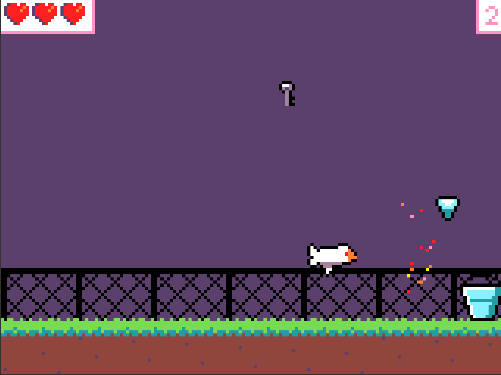
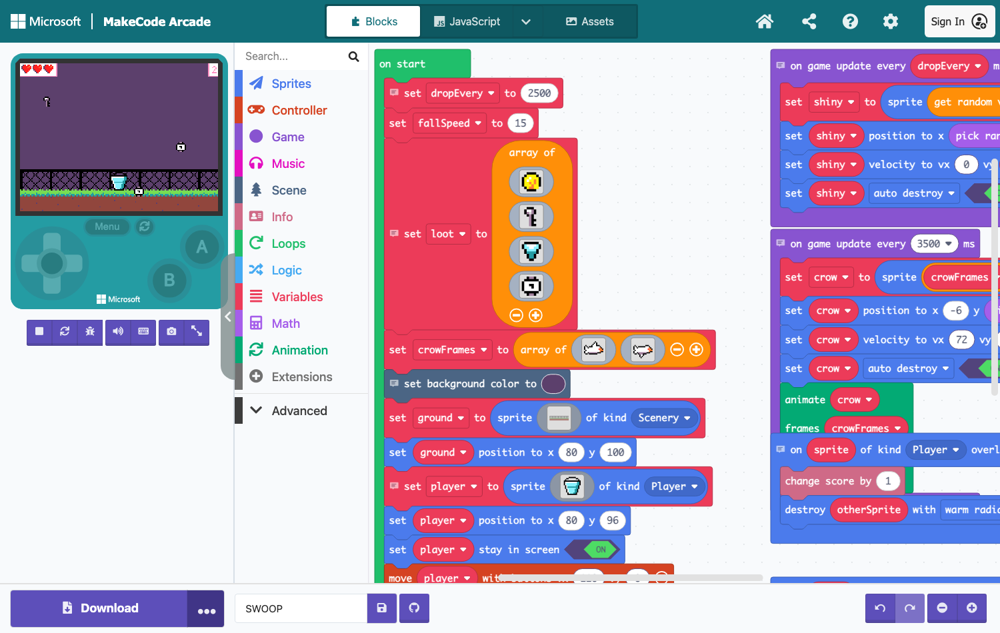

# SWOOP — MakeCode Arcade starter for the Year 6 taster

The crow has been raiding the school and stashing shiny things — coins, keys, a
gem, a watch — in its nest. The nest has tipped. You're on the ground with a
bucket, catching the loot before it hits the dirt. The crow is not happy about
this, and it swoops.

Catch the loot for points. Get swooped and you lose a life. Three lives.



## The project

`swoop/` is a complete MakeCode Arcade project.

| File | What it is |
|---|---|
| `main.blocks` | The block layout. **This is what students see.** |
| `main.ts` | The same program as TypeScript, generated by MakeCode from the blocks. |
| `pxt.json` | Project manifest. `preferredEditor: blocksprj` is what makes it open in Blocks. |
| `README.md`, `assets.json` | Deliberately near-empty. A non-empty README makes MakeCode pop an info panel over the workspace on load. |

It opens in the **Blocks** view, titled SWOOP, with nothing covering the canvas:



## The five missions

| # | Mission | The edit | Where it is in the blocks |
|---|---------|----------|---------------------------|
| **1** | Make it yours | Redraw the bucket; change the sky colour | `on start` — `set background color to` and `set player to sprite [bucket]` |
| **2** | Fix the difficulty | `dropEvery` 2500 → about **700**; `fallSpeed` 15 → about **60** | The **first two blocks** in `on start` |
| **3** | Win the season | Add `on score 15 → game over WIN` | New blocks, from Info and Game |
| **4** | Add a second crow | Right-click the `on game update every 3500 ms` crow stack → Duplicate → change the timing | Right-hand column, second stack |
| **5** | Your twist | Add a fifth shiny thing (the `+` on the `loot` array), a sound, a bigger bucket, a countdown | Anywhere |

**Mission 2's two numbers are the first two blocks in `on start`** and they are the
only bare numbers a student has to touch to change the feel of the game.

**Mission 4's swoop stack is self-contained** — six blocks under one hat, using only
`crow` and `crowFrames`. Duplicating it and changing the interval is a complete,
working second crow. Verified below.

## What was tested, and what happened

Tested against the real Arcade runtime with a scripted headless browser
(`tools/harness.mjs`), driving input and reading the game's own `console.log`.
Numbers are score / lives after a fixed run.

| Configuration | Result |
|---|---|
| Starter, no input at all | First life lost at 5–12 s; all three gone at 25–36 s. A student who never touches the D-pad still gets ~30 s of game. |
| Starter, competent play (60 s) | Score 20, survived. Playable, but visibly slow — which is the point of Mission 2. |
| **Mission 2 applied** (700 / 60), competent play (60 s) | Score 54, all three lives. Roughly **2.5× the catch rate** — the fix is felt immediately. |
| **Mission 3 applied** | Reaching 15 triggers `YOU WIN! Score:15`. Verified on screen. |
| **Mission 4**, duplicate and change only the timing (2000 ms) | Score 42 in 60 s, 2 lives left. Harder, still winnable — the intended feel. |
| **Mission 4**, crow from the right | Works, **but the crow flies backwards** — the sprite faces right. Students who send a crow the other way need to flip the picture in the sprite editor. Worth knowing before someone asks. |
| **Missions 3 + 4 together** | Won at 16 s with 2 lives left. |
| Mission 5 add-ons (sound on catch, `setScale` bigger bucket, `info.startCountdown`) | All compile and run. |

### Deliberately sloppy edits — none of them break the game

| Student does | What happens |
|---|---|
| `dropEvery = 0` | Spawns every frame. ~95 sprites on screen, score rockets, **no crash, no hang**. Silly, recoverable, arguably instructive. |
| `fallSpeed = 500` | Loot flashes past and is nearly uncatchable. No crash. |
| Sky set to white | Still playable. The crow keeps a solid black outline on every edge, so it reads even against white — this was a design requirement, not luck. Dark skies still look far better. |

### Blocks check

The check that matters most for a blocks audience (HANDOFF §5.5) was run in the
real editor at `arcade.makecode.com`: the project renders **34 block types, zero
grey/unsupported blocks**. Verified by parsing `main.blocks` for
`typescript_statement` as well as by eye.

## The printed resources

`Printables/` holds the student-facing and teacher-facing print set. Both are
standalone HTML with a `<style>` block, rendered to PDF with WeasyPrint — **never
paste either into Canvas**, the CSS is stripped and they collapse.

| File | What it is |
|---|---|
| `Mission Cards.html` / `.pdf` | Six cards: one per mission, plus a **STUCK?** reference card. Three A4 sheets, two A5-landscape cards per sheet, one straight cut across the middle. |
| `Teacher Run Sheet.html` / `.pdf` | Two A4 pages — prep checklist and timing on page 1, the desk reference on page 2. |
| `img/` | The card artwork. |

**Printing:** A4, portrait, borderless off, 100% scale (not "fit to page" — the
cut line is at exactly 148.5 mm). Cut each sheet once across the middle.
One full set is 3 sheets. For 22 students that is 66 sheets if every student gets
their own set; a set per pair, plus a STUCK card each, is 2 sheets a head.

### Why the cards look the way they do

- **Every block picture is a screenshot of the real editor**, at the real colour and
  the real size. A beginner hunts the toolbox by colour and shape, not by reading
  category names — so the card shows the thing, it doesn't describe where to click.
  The pipeline that generates them is `tools/cardshots/`.
- **Card accent colour = the toolbox drawer colour** the mission lives in. Mission 3
  is Info pink, Mission 4 is Game purple, and so on.
- **Every card has the same four parts** — what to change, where it is, how you know
  it worked, and one extension — so a student who has read one can read any of them.
- **Card copy is checked against the live toolbox**, not against memory. Two errors
  were caught that way and fixed: the Info drawer's `on score` block defaults to
  **100** (not 0), and the loot array's `⊕` is at the **bottom** of the block, not
  on its end.
- **The M4 backwards-crow quirk is on the card**, framed as the extension. It is a
  good "now fix it" moment, not a bug to hide.

## Rebuilding it

```bash
npm install makecode playwright && npx playwright install chromium
npx makecode init arcade          # first time only, in a scratch dir
```

Then, from `tools/`:

```bash
python3 variant.py                # renders main.ts from main.template.ts + ground.txt
npx makecode build                # type-checks against the real Arcade API
npx makecode serve --port 7788    # local simulator with auto-rebuild
node harness.mjs --seconds 60 --shots 20 --tag run --keys 2:right,6:left
```

`variant.py dropEvery=700 fallSpeed=60 EXTRA=missions/m3.ts` builds a mission
variant for regression testing. `mkproject.mjs` pastes `main.ts` into the real
editor, runs Format Code and exports `main.blocks`; `loadproject.mjs` loads the
finished project back in to confirm what a student sees on open.

**The simulator must not be driven through a hidden browser pane** — a
background tab is throttled by the browser, the physics loop stalls, and sprites
appear to pile up. That is a measurement artefact, not a bug in the game. The
headless harness disables the throttling.

## Still open

- **The share link is not published.** `npx makecode share` was blocked by this
  environment's permission gate, so there is no public URL yet. Steve approved the
  publish in scoping; it needs one command run with permission, or Steve can
  publish from the editor. Everything else is done and verified.
- **The crow's student nickname** — if the students have a name for the albino
  crow, that name should probably be the game's.
- **School filter untested** — does `arcade.makecode.com` load on a school laptop,
  does the preloaded project open, can a student create a share link?
- Session timing in `HANDOFF.md` §3 is still a proposal.
- ~~Printed resources~~ — **built and verified**, see `Printables/`. Not yet printed or trialled at actual size on paper.
